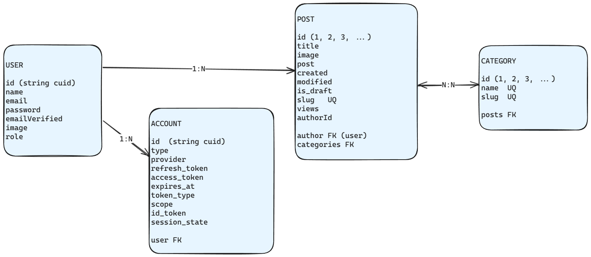

# Blog


## Dependencias

Se han instalado las siguientes dependencias:

```
npm  install  prisma  @faker-js/faker  -D  
npm  install  @prisma/client  next-auth@beta  @auth/prisma-adapter 
npm  install  lucide-react  bcryptjs  cloudinary  react-spinners  sonner  slugify
npm  install  @tiptap/react  @tiptap/pm  @tiptap/html  @tiptap/starter-kit
npm  install  @tiptap/extension-color
npm  install  @tiptap/extension-list-item 
npm  install  @tiptap/extension-text-style
```


## Inicializar BD (seed)

```
npm  run  seed
```

## Iniciar en modo desarrollo

```
npm  run  dev
```

## Diagrama E-R simplificado





# Agradecimientos

Este proyecto está basado en gran medida en uno anterior de **Miguel Chacón Barranco** aka [miguelcb04 en Github](https://github.com/miguelcb04).

- [Proyecto base](https://github.com/miguelcb04/blog-backend)

También el agradecimiento a la empresa que lo acogió para la realización de la FCT.


